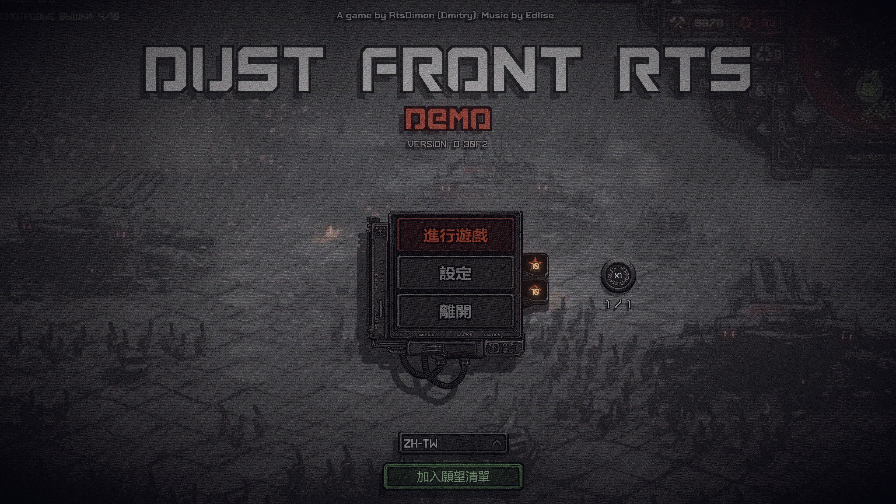
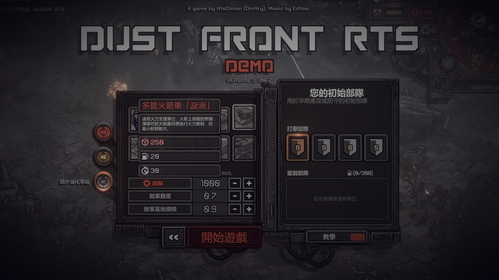
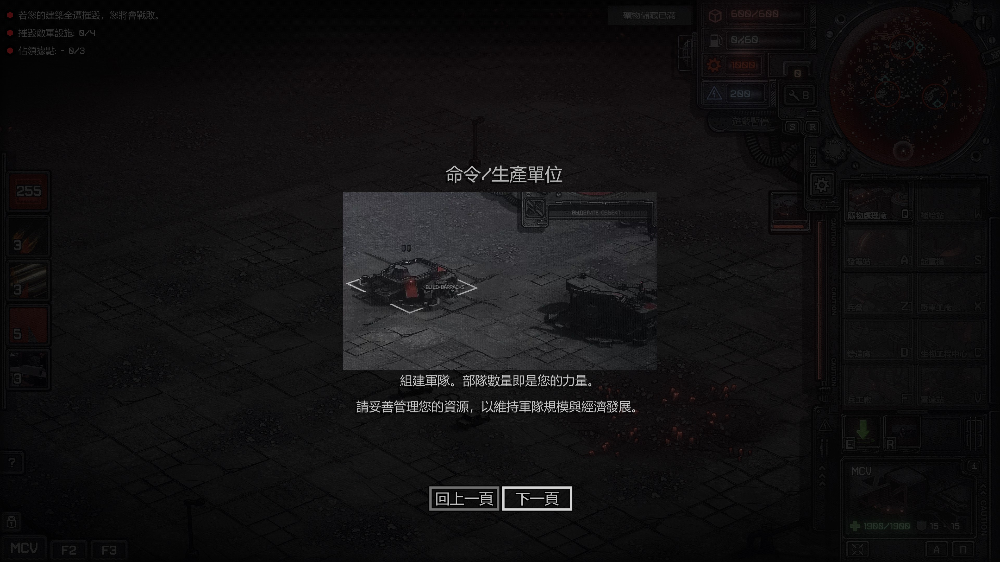
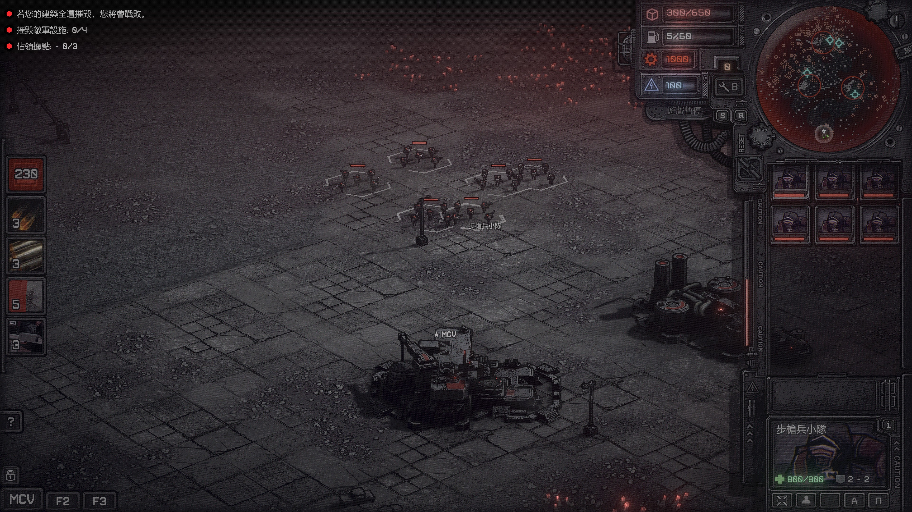
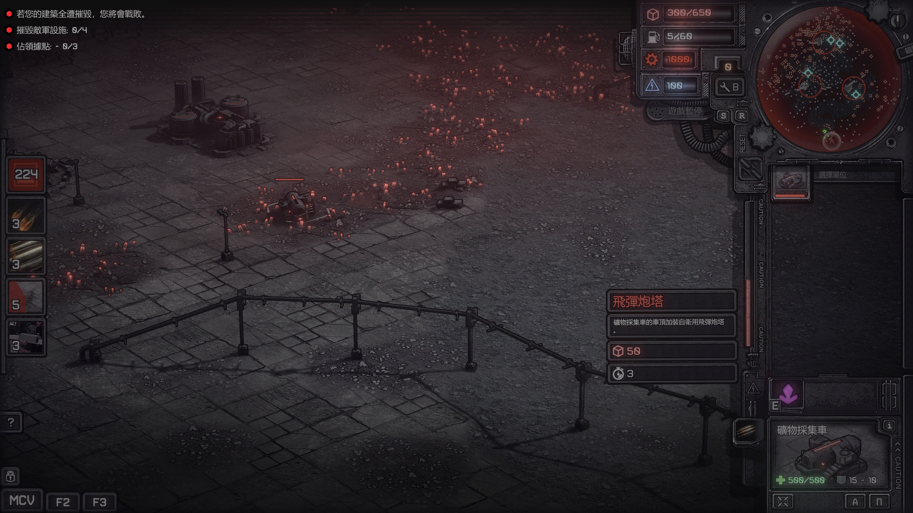
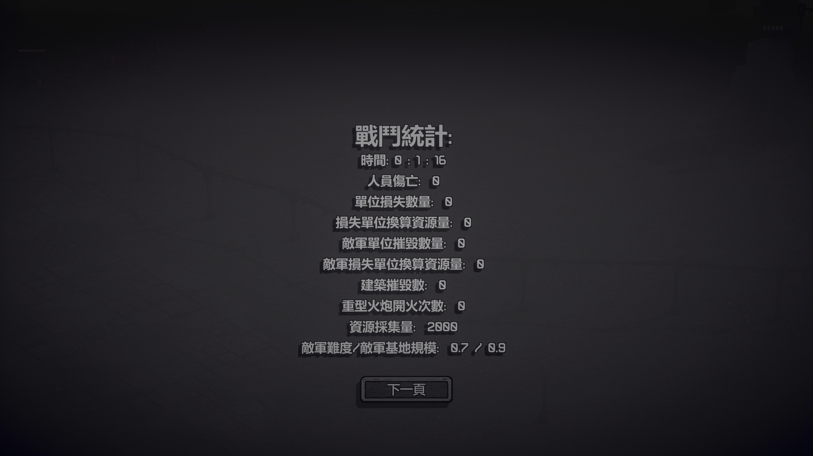

# Dust-Front-RTS-Demo_zh-TW
Dust Front RTS Demo個人繁中化

1.	由於本魯並不是什麼超專業的翻譯者，內容大致上是先把原文丟ChatGPT看結果後，再根據以往玩過同類型遊戲的經驗跟去潤飾遣詞用字。
    一些機翻後看起來比較怪的詞句，則是靠自己的理解去改寫成比較簡明扼要的版本，在此先說聲傷眼抱歉。

2.	由於原始檔內有不少Demo未開放的相關文本，個人只挑了一些跟本次試玩版中玩家能直接操控、互動跟觀看的部份去翻譯，未在此範疇內的文本就先跳過。

3.	使用方式:將下載好的resources.assets檔放到Steam路徑下的\steamapps\common\Dust Front RTS Demo\Dust Front RTS_Data\中取代原檔案(建議先將原本的resources.assets改個檔名當備份，以備不時之需)
    如果啟動遊戲碰到Steam顯示檔案受損, 就把下載回來的resources.assets檔再放到同樣路徑下取代原本檔案即可。(Steam跳錯後會主動載回原本的resources.assets檔)

4.	每次更新後都會提供對應的Sha256以供比對，若對下載的檔案不放心，可將下載的檔案上傳至網路上各個免費的Sha256線上工具網比對其Sha256雜湊值。

希望你會喜歡我的簡略翻譯成果，感謝你的青睞。 

